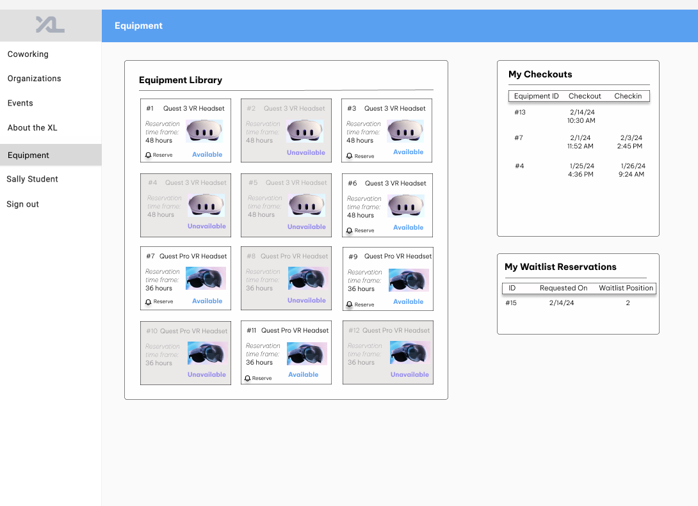

# SAMPLE: Equipment Reservation System Design Doc

> *This is a sample design doc submitted by an exceptional team last semester! Feel free to use this as inspiration for creating a design doc for your feature in the first sprint.*

**Team F8 Members:** [Lauren Feldman](https://github.com/feldman21), [Adela Zhang](https://github.com/adelaz1), [Noah Smith](https://github.com/noahsmiths), [Ben Goulet](https://github.com/bwgoulet), [Max Goetz](https://github.com/maxgoetz)

## Overview

In Spring 2024, the XL will have several new pieces technology, including Quest 3 VR Headsets, available for multi-day checkout. The offering of this cutting-edge technology will generate significant interest among students, making it imperative to establish an efficient reservation system. This new feature will not only enhance system-wide organization, but will also manage reservation time frames to help ensure all students the opportunity to enjoy this new equipment.

## Key Personas

1. **Sally Student** can see their current checkouts and browse the equipment library, which indicates the availability status of each piece of equipment. In advance of their first checkout, Sally Student will also sign a usage and liability agreement.
2. **Amy Ambassador** has the ability efficiently oversee the equipment check-in and check-out processes, which involves documenting the name and PID of the student checking out, along with all the abilities of Sally Student.
3. **Ronda Root** can manage the equipment library by adding or removing equipment as needed, as well as oversee equipment checkout history, along with all the abilities of both Sally Student and Amy Ambassador.

## User Stories

- As Sally Student, I want to see which pieces of equipment are available and unavailable for reservation so that I know what I am able to reserve.
- As Sally Student, I want to see a list of my current checkouts and the alloted time frame so I know by when I should return the equipment.
- As Sally Student, I want to sign a usage and liability form (which will be saved to my profile) in advance of my first checkout in the event of losing or carelessly breaking a piece of equipment.
- As Amy Ambassador, I want to see a list of equipment and have the ability to check out and check back in each item so that I can effectively facilitate the reservation process.
- As Amy Ambassador, I want to see, for each checked-out item, the student's name, PID, and reservation time frame so that I can look up who is using each piece of equipment and for how much longer they have it.
- As Ronda Root, I want to see a list of all the equipment, as well as have the ability to create, edit, and delete items, so that I can effectively manage and grow the XL equipment library.

## Wireframes

All wireframes and the full user flow of the Equipment Reservation function can be found on [Figma](https://www.figma.com/file/BNYIZ98I59kguzN6CVcbES/Equipment-Reservation?type=design&node-id=53%3A2&mode=design&t=4rNuvyfRdbYt0BUS-1).

### Sally Student

As **Sally Student**, a new tab on the sidebar, **Equipment**, will be added to view all available equipment and equipment that they personally have checked out currently. Equipment that is unavailable will be grayed out.

**Sally Student** will also be able to sign a Usage and Liability Agreement in their **Profile** tab prior to checking out any equipment, which will be indicated on their profile.

### Amy Ambassador

As **Amy Ambassador**, the **Equipment** tab on the sidebar will be the same view as **Sally Student**'s. However, the existing **XL Ambassador** tab will now be separated into two tabs, including the **Equipment Reservations** tab, which will hold a list of all equipment and can be used to checkin/checkout equipment as students use them.

Upon pressing **Check Out**, **Amy Ambassador** will then be able to input the student's PID and checkout date/time, before a snackbar appears if no errors occurred. The page upon pressing **Check In** is modeled very similarly.

Lastly, if the student has not signed the Usage and Liability agreement, an error message will pop up immediately upon entering the student PID, before **Amy Ambassador** can submit the checkout.

### Ronda Root

As **Ronda Root**, the **Equipment** and **XL Ambassador** tabs on the sidebar will be the same view as **Sally Student**'s and **Amy Ambassador**'s, respectively.

On **Ronda Root's** **User Admin** page, there will be a new **Equipment** tab that lists all of the equipment in the XL, ordered by ID. This page offers the ability for **Ronda Root** to add new equipment, as well as delete existing items.

By clicking on each piece of equipment, **Ronda Root** can view and edit its information, including including the model, date added, and reservation time frame.

## Technical Implementation Opportunities and Planning

**Existing Codebase**

- Dependencies
  - Users: When equipment is checked out, we'll need to track who it's checked out to by connecting it to a user object.
  - Roles: Functionality will differ between roles. For example, a student should only see their own checkouts, while an ambassador should additionally have access to a page to control check-ins/check-outs.
    - By extension, this means we also rely on the current auth system to know who can access/modify certain data.
  - For keeping track of users who have signed a liability form, we may be able to leverage the current permission entity/model.
- Extensions
  - Entirely new database tables and data schemas will be required to store equipment information, but they will need to exist in a way to interact with and live on top of existing database information (especially users).
    - Tables will most likely include one for the equipment itself, and one for check-ins/check-outs which will also allow for checkout history.
    - Given the relational nature of our data, check-ins/check-outs will themselves point to a user and piece of equipment.
  - Some of the frontend will need to be augmented with a tab system to accomodate new features without cluttering up the UI.
    - A tab will likely be added to the XL Ambassador component for managing equipment checkouts.
- **Page Components and Widgets**
  - Equipment Component: Side-nav route accessible for all user stories. Displays equipment library, user checkouts, and users' equipment reservations. In the future, the functionality of this tab may involve navigation for each of these capabilities.
  - XL Ambassador Equipment Reservations Component: Create a new tab for equipment reservations for XL Ambassador. Create table of check-in widgets so Ambassadors can check-in or check-out equipment for students.
  - XL Ambassador Check-Out Form Component: Form for checking out equipment, requiring student PID and checkout date/time. If the student's Usage and Liability Agreement is not signed, diables check out functionality.
  - User Admin Equipment Management Component: New route so that admins can add/delete items from the qeuipment library.
  - User Admin View/Edit Component: Interface for viewing/editing existing equipment.
  - User Admin Equipment Creation Component: Interface for adding new equipment to the equipment library.
  - Equipment Card Widget: Cards for pieces of equipment in the equipment library. Displays availability status, id number, equipment name, reservation time frame, and a button to reserve (may scrap this).
  - XL Ambassador Equipment Reservation Widget: Table row widget for individual entries in the equipment library, with the corresponding ID and check-in/out functionality.
  - XL Ambassador Check-in widget: Form for checking in/out equipment.
  - User Admin Equipment Deletion Widget: Table row wdiget for individual entries in the equipment library, with the corresponding ID, name and deletion functionality.
  - User Admin Equipment View/Edit Widget: Form for viewing/editing equipment.
  - User Admin Equipmetn Creating Widget: Form for creating equipment entries.
- **Models**
  - Reservation: Model used to store all the information necessary for a reservation. Encapsulates the equipment object associated with the reservation, the PID of the user who checked the item out, the start date of the reservation, and the end date of the reservation. Does not follow a specific design pattern.
  - Historical Reservations: Model used to store all the reservations ever made. Encapsulates Reservation models. Does not follow a specific design pattern.
  - Equipment: Model used to store all the information about a piece of equipment in our system. Encapsulates the specific ID number of the equipment, a basic description of the equipment, and the reservation model associated with the equipment if currently reserved. Follows the multiton design pattern.
  - Inventory: Model used to store all the information about what equipment we currently have. Encapsulates every Equipment model in our system. Follows the Singleton design pattern.
  - Available Inventory: Submodel of the inventory model. Only encapsulates the equipment models that are not currently reserved. Follows the Singleton design pattern.
  - Eligible Users: Model used to store every user who has signed the eligibility form. Encapsulates user models. Follows the Singleton design pattern.
- **API / Routes**
  - Get Equipment (/equipment): Returns the current inventory model. Intended purpose is to display every piece of equipment in our system. Used by all personas.
  - Get Unreserved Equipment (/equipment): Returns the current available inventory model. Intended purpose is to inform users what items are available/unavailable. Used by all personas.
  - Get User Reservations (/equipment/reservations/{user_pid}): Returns the user's reservations. Intended purpose is to show the user what checkouts they currently have and when they are due. Used by all personas.
  - Post Liability Form (/profile): Receives user information after the liability form is signed. Intended purpose is update the eligible users model. Used by all personas.
  - Post Reservation (/equipment/reservation): Receives reservation information. Intended purpose is to create a reservation object and update the reservation database. Used by Amy Ambassador and Ronda Root.
  - Delete Reservation (/equipment/reservation): Deletes a reservation from our system. Intended purpose is to update the reservation database. Used by Amy Ambassador and Ronda Root.
  - Get Reservations (/equipment/reservations): Returns all the current reservation objects. Intended purpose is to update Amy Ambassador on what equipment is currently reserved and who has it. Used by Amy Ambassador and Ronda Root.
  - Post Equipment (/equipment/post): Receives information on a new piece of equipment. Intended purpose is to create a new equipment object and update our equipment database. Used by Ronda Root.
  - Delete Equipment (/equipment/delete): Deletes a piece of equipment from our system. Intended purpose is to update our equipment database. Used by Ronda Root.
- **Security and Privacy concerns**
  - All user stories will also be able to sign a Usage and Liability Agreement in their Profile tab prior to checking out any equipment, which will be indicated on their profile.
  - Only XL Ambassadors and Ronda Root can edit/create check-ins and check-outs.
  - Ronda Root is the only persona that can add/delete equipment entries
